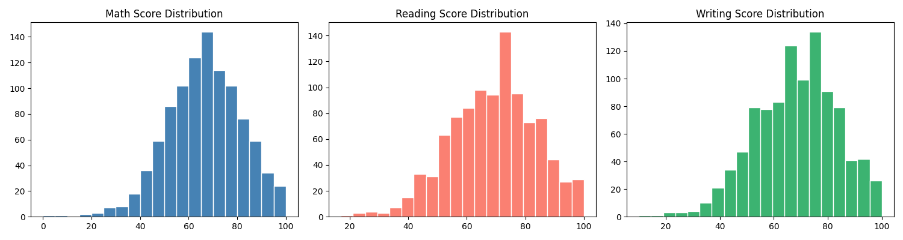
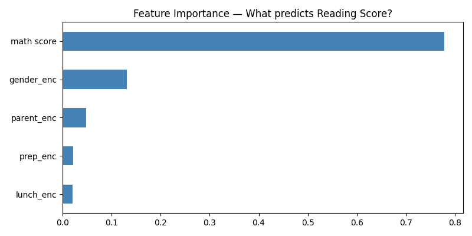
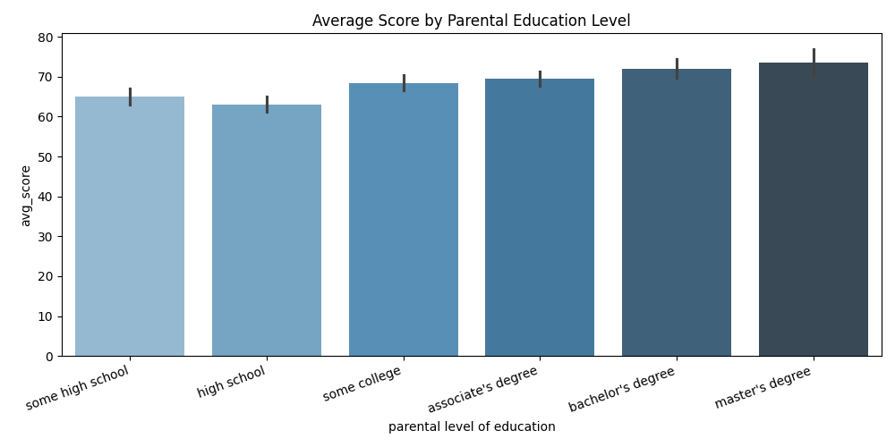

# 🎓 Student Score Predictor

A production-ready machine learning web app that predicts a student's reading score using demographic and academic features, with an interactive dashboard for real-time inference.

## 🔗 Live Demo
👉 https://student-score-predictor.streamlit.app

---

## 🧠 Problem Statement

Educational institutions often lack tools to identify students who may need academic support early.  
This project builds a predictive system to estimate reading scores and flag high/low performers based on input features.

---

## ⚙️ System Architecture

User Input (Streamlit UI)
↓
Data Preprocessing (Encoding, Scaling)
↓
ML Model (Linear Regression / Random Forest)
↓
Prediction Output (Score + Classification)
↓
Visualization Layer (EDA + Feature Insights)
## 📊 Results

| Model              | R² Score | RMSE |
|--------------------|----------|------|
| Linear Regression  | 0.845    | —    |
| Random Forest      | 0.792    | 6.86 |

> Linear Regression performed better, indicating a strong linear relationship between features like math score and reading score.

---

## 📂 Dataset

- Source: Student Performance Dataset
- Features used:
  - Gender
  - Parental level of education
  - Lunch type
  - Test preparation course
  - Math score
  - Writing score

---

## 🔍 Key Insights (EDA)

- Students with completed test preparation perform significantly better
- Strong correlation between math, writing, and reading scores
- Parental education shows moderate impact on performance

---

## 🛠️ Tech Stack

- **Backend / ML**: Python, Scikit-learn
- **Data Processing**: Pandas, NumPy
- **Visualization**: Matplotlib, Seaborn
- **Frontend**: Streamlit

---

## 🚀 Features

- Real-time prediction via Streamlit UI
- Dual modeling:
  - Regression (exact score prediction)
  - Classification (high performer flag)
- Feature importance visualization
- Interactive sliders for user input

---

## 🚀 Run Locally

```bash
git clone https://github.com/yajatsuri/student-score-predictor.git
cd student-score-predictor
pip install -r requirements.txt
streamlit run app.py
```

## 📈 Charts

### Score Distributions


### Feature Importance


### Scores by Parental Education


## 🚀 Run Locally
bash
git clone https://github.com/yajatsuri/student-score-predictor.git
cd student-score-predictor
pip install -r requirements.txt
streamlit run app.py
## 📈 Charts### Score Distributions

### Feature Importance

### Scores by Parental Education

## 👤 Author
**Yajat Suri** · [LinkedIn](https://linkedin.com/in/yajat-suri) · [GitHub](https://github.com/yajatsuri)
EOF
